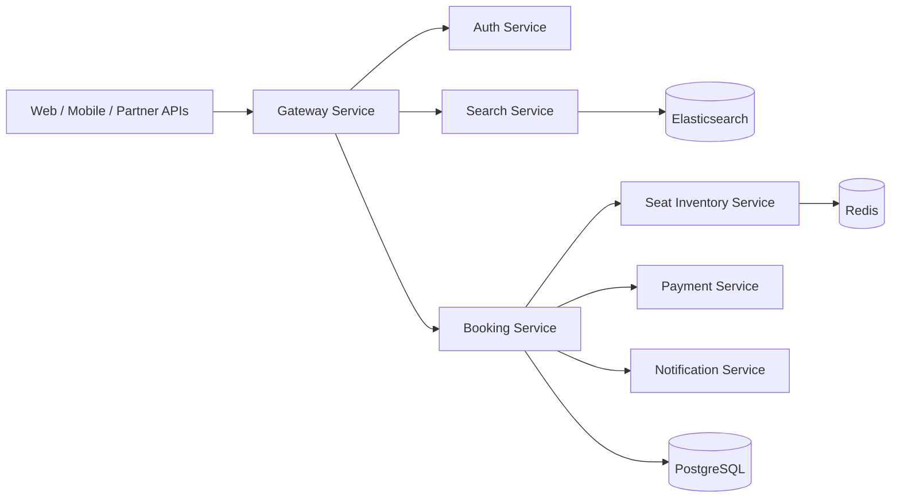

# Architecture

## Design Principles

- DDD bounded contexts per service
- Separate database per service
- Event-driven communication for downstream effects
- Synchronous request paths only where consistency is required
- Outbox pattern for reliable event publication
- Idempotency keys on booking and payment flows
