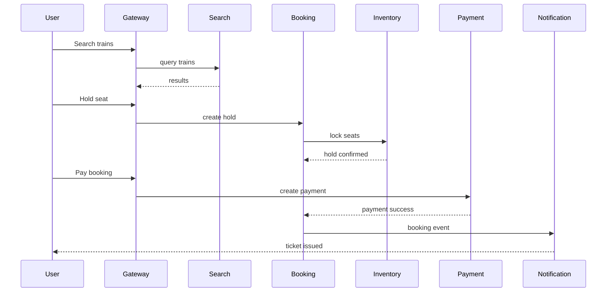

# Booking Sequence

```mermaid
sequenceDiagram
  participant U as User
  participant G as Gateway
  participant S as Search
  participant B as Booking
  participant I as Inventory
  participant P as Payment
  participant N as Notification

  U->>G: Search trains
  G->>S: query trains
  S-->>G: results
  U->>G: Hold seat
  G->>B: create hold
  B->>I: lock seats
  I-->>B: hold confirmed
  U->>G: Pay booking
  G->>P: create payment
  P-->>B: payment success
  B->>N: booking event
  N-->>U: ticket issued
```
